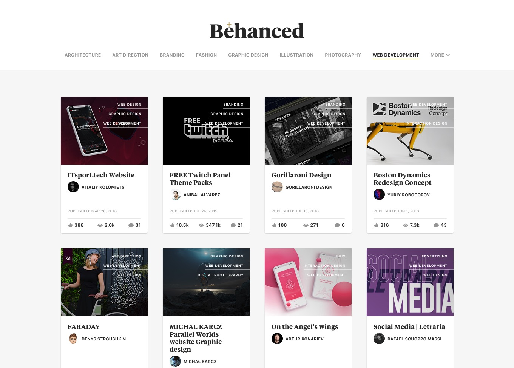
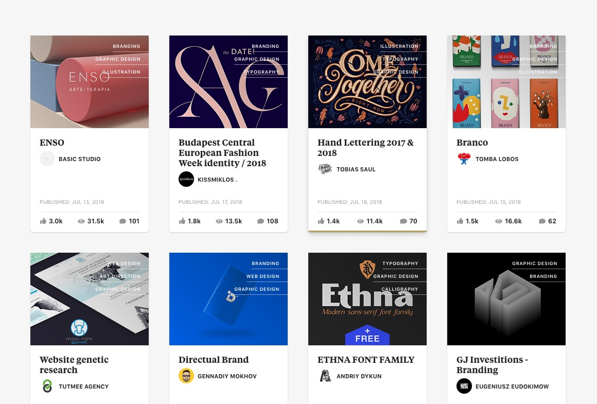
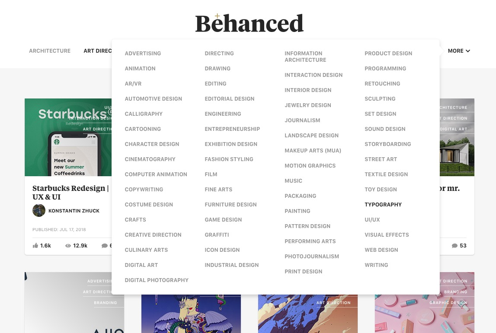

# Behanced

Behance, _enhanced_.

A simple, minimalist Adobe Behance clone built with React, JavaScript ES6, Babel, webpack, Sass, axios, and the Behance API.

**Card/UI design refinements & improvements:**

* Developed navigation bar with popular fields as data filters
* Created nav dropdown menu component with all available creative fields
* Added multiple creative fields/categories, as available, overlaid on card image
* Decreased # of cards to 4 per row
* Increased project title font size for clearer hierarchy
* Added project owner avatars
* Added project published date
* Added # of comments
* Abbreviated large numbers

## Local Setup

1.  Clone this repository to your desktop:

```
git clone https://github.com/samsjchi/behanced.git
```

2.  Navigate to the directory and install dependencies:

```
npm install
```

3.  Build and start the app:

```
npm start
```

## Screenshots





## Documentation

* [React](https://reactjs.org/docs/getting-started.html)
* [Babel](https://babeljs.io/docs/en/index.html)
* [webpack](https://webpack.js.org/concepts/)
* [Sass](https://sass-lang.com/documentation/file.SASS_REFERENCE.html)
* [axios](https://www.npmjs.com/package/axios)
* [Behance API](https://www.behance.net/dev)
